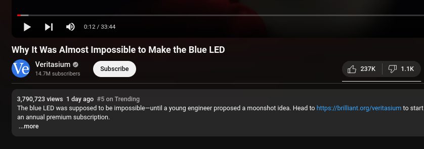
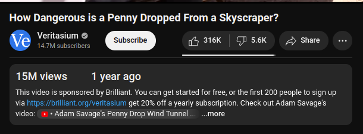

<h1 align="center">YouTube views and creation date styling</h1>

Changes styling of view count and creation date elements under YouTube videos for better visibility

 

## Installation options

This is no longer available as a browser extension. Paste the JavaScript code into a website injector extension. This has been tested on [Code Injector](https://chromewebstore.google.com/detail/code-injector/edkcmfocepnifkbnbkmlcmegedeikdeb) for Chrome.
