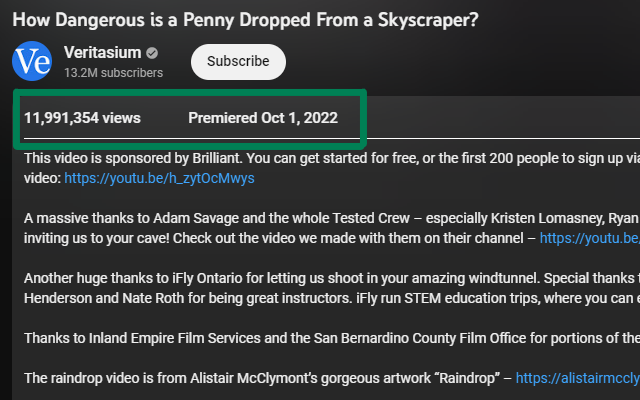

<h1 align="center">YouTube views and creation date styling</h1>

Changes styling of view count and creation date elements under YouTube videos for better visibility

 

## Installation options

1. Download the [Chrome](https://chrome.google.com/webstore/detail/youtube-views-and-creatio/bjnnepoibpbppckipbggcajaclfjdbhb) extension. The Firefox extension is pending...

2. Paste the JavaScript code into a website injector extension like:
    - [Page Manipulator](https://chrome.google.com/webstore/detail/page-manipulator/mdhellggnoabbnnchkeniomkpghbekko?hl=en) for Chrome 
    - [Code Injector](https://addons.mozilla.org/en-US/firefox/addon/codeinjector/) for Firefox
    - [Userscripts](https://apps.apple.com/us/app/userscripts/id1463298887) for Safari
