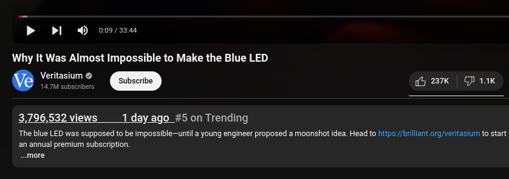

<h1 align="center">YouTube views and creation date styling</h1>

Changes styling of view count and creation date elements under YouTube videos for better visibility

 

## Installation options

This is no longer available as a browser extension. Paste the JavaScript code into a website injector. It was tested inside Code Injector for [Chrome](https://chromewebstore.google.com/detail/code-injector/edkcmfocepnifkbnbkmlcmegedeikdeb) and [Firefox](https://addons.mozilla.org/en-US/firefox/addon/codeinjector/).
